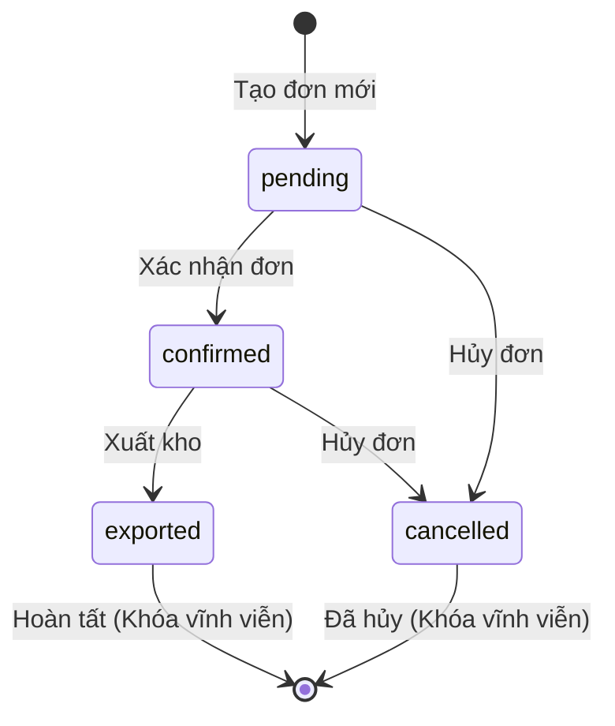
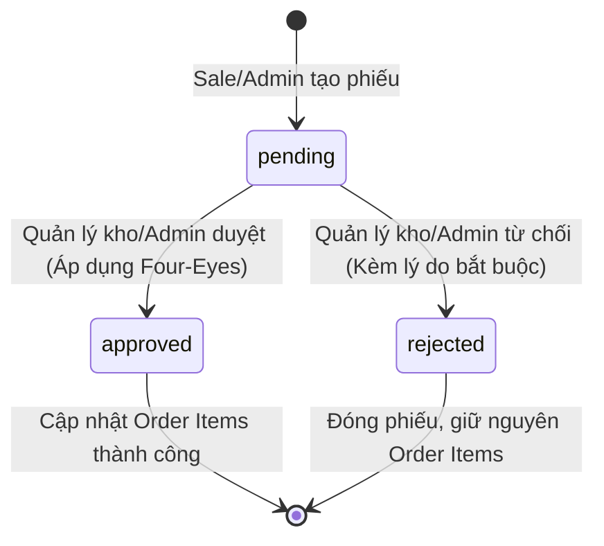

# ĐẶC TẢ HỢP ĐỒNG KỸ THUẬT FRONTEND - BACKEND (FE-BE CONTRACT)
**Dự án:** KÜCHEN Enterprise Order Adjustment Portal  
**Phiên bản Hợp đồng:** v1.2-Final  
**Giao thức:** HTTP/1.1 & HTTP/2 with Blade Server-Side Rendering (SSR) & RESTful Endpoints  
**Tiêu chuẩn bảo mật:** CSRF Token, Database-Driven RBAC, Pessimistic Locking, Four-Eyes Principle

---

## 1. NGUYÊN TẮC THIẾT KẾ & QUY ƯỚC CHUNG

### 1.1. Chuẩn giao tiếp
- **Mã hóa truyền tải:** HTTPS / SSL 256-bit.
- **CSRF Protection:** Mọi request mang phương thức thay đổi trạng thái dữ liệu (`POST`, `PUT`, `DELETE`) bắt buộc phải đính kèm Header `X-CSRF-TOKEN` hoặc trường `@csrf` trong form payload.
- **Xác thực phiên làm việc (Session):** Phiên đăng nhập được quản lý bằng HttpOnly Encrypted Session Cookies kết hợp bảng `sessions` trong Database.
- **Định dạng dữ liệu:**
  - Tiền tệ: Đơn vị VNĐ, làm tròn nguyên tệ (`integer`), hiển thị giao diện qua định dạng phân cách hàng nghìn (ví dụ: `15.000.000 ₫`).
  - Ngày giờ: Định dạng ISO-8601 (`YYYY-MM-DDTHH:mm:ssZ`) tại tầng Database; hiển thị giao diện theo chuẩn Việt Nam `dd/mm/YYYY HH:mm`.

---

## 2. MA TRẬN PHÂN QUYỀN TRUY CẬP (RBAC AUTHORIZATION MATRIX)

| Mã Phân Quyền (Permission) | Tên Quyền | Phân hệ | SALE | QUẢN LÝ KHO | ADMIN |
|---|---|---|:---:|:---:|:---:|
| `order.view` | Xem & Tra cứu đơn hàng | Đơn hàng | ✅ | ✅ | ✅ |
| `order.adjustment.view` | Xem danh sách & Chi tiết phiếu điều chỉnh | Điều chỉnh | ✅ | ✅ | ✅ |
| `order.adjustment.create` | Tạo yêu cầu điều chỉnh đơn hàng | Điều chỉnh | ✅ | ❌ | ✅ |
| `order.adjustment.approve` | Phê duyệt yêu cầu điều chỉnh | Điều chỉnh | ❌ | ✅* | ✅* |
| `order.adjustment.reject` | Từ chối yêu cầu điều chỉnh | Điều chỉnh | ❌ | ✅* | ✅* |
| `role.view` | Xem Ma trận Vai trò & Quyền hạn | Hệ thống | ✅ | ✅ | ✅ |
| `system.manage` | Quản trị tham số toàn hệ thống | Hệ thống | ❌ | ❌ | ✅ |

> **(*) Ràng buộc Nguyên tắc Four-Eyes (Segregation of Duties - SoD):**  
> Dù người dùng thuộc vai trò `warehouse_manager` hoặc `admin`, nếu người dùng đó là người tạo (`created_by === current_user_id`) của chính phiếu điều chỉnh đang xét thì quyền `approve` và `reject` sẽ tự động bị vô hiệu hóa (`HTTP 403 Forbidden`).

---

## 3. STATE MACHINE (MÁY TRẠNG THÁI NGHIỆP VỤ)

### 3.1. Trạng thái Đơn hàng (`orders.status`)

- **Quy tắc điều chỉnh (`canBeAdjusted`):** Đơn hàng CHỈ được phép tạo yêu cầu điều chỉnh khi trạng thái thuộc `['pending', 'confirmed']`. Nếu đơn đã `exported` hoặc `cancelled`, hệ thống lập tức chặn tạo điều chỉnh.

### 3.2. Trạng thái Phiếu điều chỉnh (`order_adjustments.status`)


---

## 4. CHI TIẾT CÁC ENDPOINTS & CONTRACT GIAO TIẾP

### 4.1. Phân hệ Xác thực (Authentication)
#### `POST /login`
- **Mục đích:** Đăng nhập tài khoản nhân sự.
- **Middleware:** `guest`, `RateLimiter` (tối đa 5 lần/phút).
- **Request Payload:**
  ```json
  {
    "_token": "string (CSRF token bắt buộc)",
    "email": "string (email hoặc username nhân sự)",
    "password": "string (mật khẩu)",
    "remember": "boolean (tùy chọn)"
  }
  ```
- **Xử lý Response:**
  - `302 Redirect` tới intended URL (mặc định `/orders`) kèm flash session `success`.
  - Nếu thất bại: `302 Redirect Back` với error message tại trường `email`.
  - Nếu vượt quá rate limit: `302 Redirect Back` với cảnh báo bảo mật thời gian chờ.

#### `POST /logout`
- **Mục đích:** Hủy phiên làm việc và bảo mật tài khoản.
- **Middleware:** `auth`.
- **Request Payload:** `_token`
- **Response:** `302 Redirect` về `/login` với thông báo đăng xuất an toàn.

---

### 4.2. Phân hệ Đơn hàng (Orders)
#### `GET /orders`
- **Mục đích:** Danh sách và tra cứu đơn hàng đa kênh.
- **Middleware:** Không bắt buộc (Guest xem được tổng quan, Auth hiển thị đầy đủ hành động nghiệp vụ).
- **Query Parameters:**
  | Tên tham số | Kiểu | Mô tả |
  |---|---|---|
  | `search` | `string` | Tìm kiếm theo mã đơn hàng (`order_code`) |
  | `channel` | `string` | Lọc kênh bán: `sale`, `shopee`, `tiktok`, `lazada`, `retail` |
  | `status` | `string` | Lọc trạng thái đơn: `pending`, `confirmed`, `exported`, `cancelled` |
  | `page` | `integer` | Số trang phân trang (Mặc định: 1, limit 20 bản ghi/trang) |
- **Dữ liệu truyền vào View (`orders.index`):**
  - `orders`: `LengthAwarePaginator<Order>` (Eager loading `items.productVariant.product`, `creator`, `pendingAdjustment`).
  - `search`: Chuỗi tìm kiếm hiện tại.
  - `channel`: Kênh đang lọc.
  - `status`: Trạng thái đang lọc.
  - `channels`: Danh mục tên kênh tiếng Việt.
  - `statuses`: Danh mục trạng thái đơn tiếng Việt.
  - `pendingAdjustmentsCount`: Số lượng phiếu điều chỉnh đang chờ duyệt trên toàn hệ thống.

---

### 4.3. Phân hệ Điều chỉnh Đơn hàng (Order Adjustments)
#### `GET /adjustments/create?order_id={id}`
- **Mục đích:** Hiển thị form tạo yêu cầu điều chỉnh đơn hàng.
- **Middleware:** `auth`, `can:order.adjustment.create`.
- **Query Parameters:** `order_id` (bắt buộc, ID đơn hàng cần điều chỉnh).
- **Ràng buộc tiền điều kiện (Preconditions):**
  - Đơn hàng phải tồn tại và `canBeAdjusted() === true`.
  - Đơn hàng không được có phiếu điều chỉnh nào đang ở trạng thái `pending`.
- **Dữ liệu truyền vào View (`adjustments.create`):**
  - `order`: `Order` (kèm `items.productVariant.product`).
  - `allVariants`: Danh sách biến thể sản phẩm KÜCHEN có sẵn trong hệ thống để chọn đổi.

#### `POST /adjustments`
- **Mục đích:** Tiếp nhận và lưu phiếu yêu cầu điều chỉnh.
- **Middleware:** `auth`, `can:order.adjustment.create`.
- **Request Payload:**
  ```json
  {
    "_token": "string",
    "order_id": 101,
    "reason": "Khách hàng đổi mẫu bếp sang GL-889 và tăng số lượng từ 1 lên 2",
    "items": [
      {
        "order_item_id": 205,
        "new_sku": "KC-001",
        "new_quantity": 2
      }
    ]
  }
  ```
- **Validation Rules (StoreAdjustmentRequest):**
  - `order_id`: `['required', 'integer', 'exists:orders,id']`
  - `reason`: `['required', 'string', 'min:5', 'max:1000']`
  - `items`: `['required', 'array', 'min:1']`
  - `items.*.order_item_id`: `['required', 'integer', 'exists:order_items,id']`
  - `items.*.new_sku`: `['required', 'string', 'exists:product_variants,sku']`
  - `items.*.new_quantity`: `['required', 'integer', 'min:1', 'max:999']`
  - Ràng buộc nghiệp vụ: Mọi `order_item_id` phải thuộc về `order_id` chỉ định và không được trùng lặp trong cùng một request.
- **Cơ chế xử lý Backend:**
  - Khởi tạo `DB::transaction`.
  - Khóa bi quan `Order::where('id', $orderId)->lockForUpdate()`.
  - Tạo `OrderAdjustment` với `code` tự sinh (`ADJ-XXXXXX`), `status = 'pending'`.
  - Lưu chi tiết vào `order_adjustment_items`.
  - **KHÔNG THAY ĐỔI** bảng `order_items` tại thời điểm này.
- **Response:** `302 Redirect` về `/orders` kèm `session('success', "Tạo yêu cầu điều chỉnh ADJ-XXXXXX thành công...")`.

#### `GET /adjustments/{id}`
- **Mục đích:** Xem chi tiết phiếu điều chỉnh, bảng so sánh Trước/Sau và lịch sử xử lý.
- **Middleware:** `auth`, `can:order.adjustment.view`.
- **Dữ liệu truyền vào View (`adjustments.show`):**
  - `adjustment`: `OrderAdjustment` (eager loading `order.items`, `creator`, `reviewer`, `items.orderItem.productVariant.product`, `items.newProductVariant.product`).
  - `canApprove`: `boolean` (kiểm tra Policy `approve` bao gồm Four-Eyes).
  - `canReject`: `boolean` (kiểm tra Policy `reject` bao gồm Four-Eyes).
  - `isCreator`: `boolean` (để hiển thị thông báo Four-Eyes thân thiện).

#### `POST /adjustments/{id}/approve`
- **Mục đích:** Phê duyệt yêu cầu điều chỉnh.
- **Middleware:** `auth`, Policy `approve` (chặn Sale và chặn Four-Eyes).
- **Request Payload:** `_token`
- **Cơ chế xử lý Backend:**
  - Khởi tạo `DB::transaction`.
  - Khóa bi quan `OrderAdjustment::where('id', $id)->lockForUpdate()`.
  - Khóa bi quan `Order::where('id', $adj->order_id)->lockForUpdate()`.
  - Kiểm tra `adjustment.status === 'pending'` và `order.canBeAdjusted()`.
  - Cập nhật dòng sản phẩm trong `order_items` theo đúng `new_product_variant_id`, `new_quantity`, `new_price`.
  - Cập nhật `order_adjustments.status = 'approved'`, `reviewed_by = auth()->id()`, `reviewed_at = now()`.
- **Response:** `302 Redirect Back` kèm `session('success', "Đã phê duyệt yêu cầu ADJ-XXXXXX thành công...")`.

#### `POST /adjustments/{id}/reject`
- **Mục đích:** Từ chối yêu cầu điều chỉnh kèm lý do.
- **Middleware:** `auth`, Policy `reject` (chặn Sale và chặn Four-Eyes).
- **Request Payload:**
  ```json
  {
    "_token": "string",
    "reason": "Sản phẩm đổi không còn hàng trong kho miền Bắc"
  }
  ```
- **Validation Rules (RejectAdjustmentRequest):**
  - `reason`: `['required', 'string', 'min:5', 'max:1000']`
- **Cơ chế xử lý Backend:**
  - Khởi tạo `DB::transaction`.
  - Khóa bi quan `OrderAdjustment::where('id', $id)->lockForUpdate()`.
  - Cập nhật `status = 'rejected'`, `reject_reason = $reason`, `reviewed_by = auth()->id()`, `reviewed_at = now()`.
  - Giữ nguyên toàn bộ dữ liệu của `order_items`.
- **Response:** `302 Redirect Back` kèm `session('success', "Đã từ chối yêu cầu ADJ-XXXXXX...")`.

---

## 5. MÔ HÌNH LỖI VÀ MÃ TRẢ VỀ (ERROR CODES & HTTP STATUS)

| HTTP Status | Trường hợp phát sinh | Phản hồi giao diện người dùng |
|---|---|---|
| `401 Unauthorized` | Người dùng chưa đăng nhập truy cập route nội bộ | Tự động chuyển hướng về `/login` với thông báo mời đăng nhập. |
| `403 Forbidden` | Nhân viên Sale cố gắng bấm duyệt đơn, hoặc Quản lý cố tự duyệt đơn của chính mình (Four-Eyes) | Hiển thị thông báo quyền hạn bị từ chối với lý do rõ ràng. |
| `404 Not Found` | Đơn hàng hoặc phiếu điều chỉnh không tồn tại | Chuyển hướng về danh sách với thông báo không tìm thấy dữ liệu. |
| `422 Unprocessable Entity` | Form submit thiếu trường hoặc sai định dạng | Đánh dấu input đỏ kèm thông báo lỗi cụ thể dưới từng trường nhập liệu. |
| `429 Too Many Requests` | Thử đăng nhập sai quá 5 lần trong 1 phút | Khóa form đăng nhập và đếm ngược số giây chờ an toàn. |
| `500 Server Error` | Lỗi ngoại lệ hệ thống không mong muốn | Bắt lỗi qua Database Transaction Rollback, hiển thị thông báo lỗi thân thiện. |
