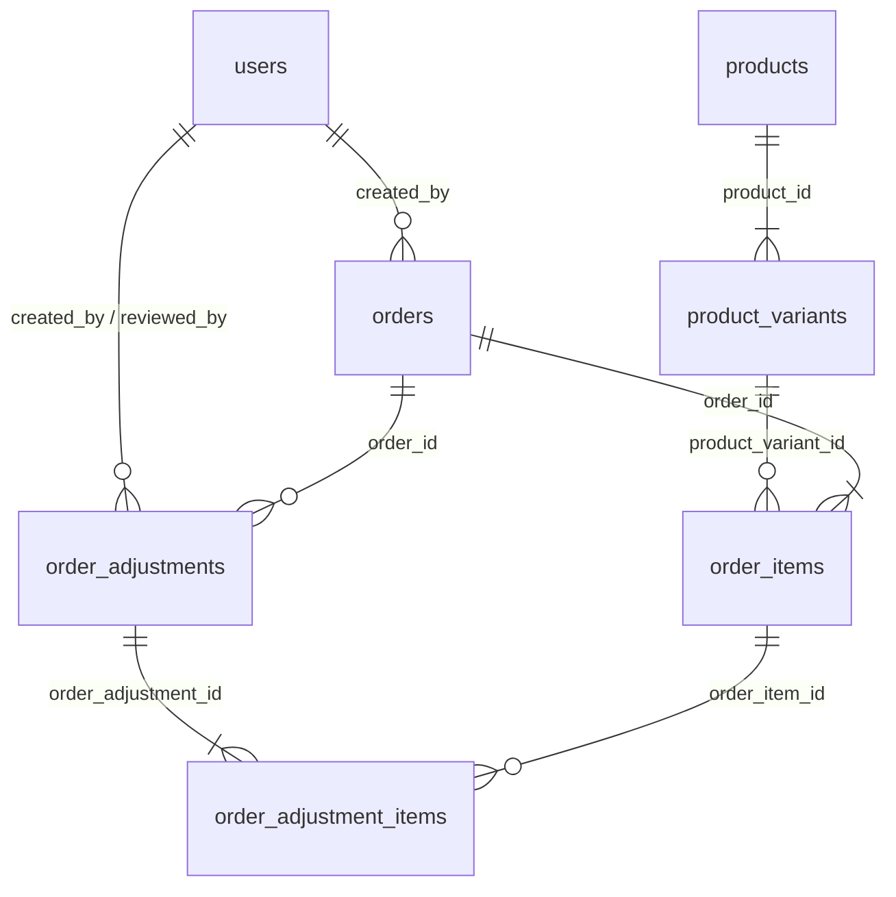

# 🧠 BMAD MEMORY — BÀI 1: DATABASE, MIGRATION VÀ MODEL

> **Điều hướng:** [🏠 Mục lục Memory](README.md) | [Bài 2: Danh sách đơn hàng ➔](02_bai_2_order_list_and_search.md)  
> **Điểm số:** 10 / 10  
> **Trạng thái:** ✅ Đã hoàn thành & Kiểm thử tự động PASS 100%

---

## 1. MỤC TIÊU NGHIỆP VỤ
Thiết kế hệ thống cơ sở dữ liệu tinh gọn nhưng đầy đủ cho nghiệp vụ **Yêu cầu điều chỉnh đơn hàng** tại KÜCHEN:
- Bao gồm dữ liệu nền tảng (`users`, `products`, `product_variants`, `orders`, `order_items`).
- Dữ liệu nghiệp vụ mới theo mô hình Master - Detail (`order_adjustments` và `order_adjustment_items`).
- Lưu trữ đầy đủ: Mã duy nhất (ví dụ `ADJ-000001`), đơn hàng, người tạo, lý do, trạng thái (`pending`, `approved`, `rejected`), người xử lý, lý do từ chối, thời gian và giá trị SKU/số lượng trước - sau.

---

## 2. SƠ ĐỒ THỰC THỂ QUAN HỆ (ERD)

---

## 3. CẤU TRÚC BẢNG & MIGRATIONS

### 3.1. Bảng `order_adjustments` (Header yêu cầu)
*File migration:* `database/migrations/2026_10_05_000003_create_order_adjustments_and_items_tables.php`
- `id`: Bigint unsigned PK
- `code`: Varchar(50) **UNIQUE** (Mã yêu cầu: `ADJ-000001`)
- `order_id`: Bigint unsigned FK $\rightarrow$ `orders.id` (`cascadeOnDelete`)
- `created_by`: Bigint unsigned FK $\rightarrow$ `users.id` (Nhân viên SALE gửi yêu cầu)
- `status`: Varchar(20) Index (Giá trị: `pending`, `approved`, `rejected`; mặc định `pending`)
- `reason`: Text (Lý do điều chỉnh - Bắt buộc)
- `reviewed_by`: Bigint unsigned Nullable FK $\rightarrow$ `users.id` (Quản lý kho duyệt/từ chối)
- `rejected_reason`: Text Nullable (Bắt buộc nếu bị từ chối)
- `reviewed_at`: Timestamp Nullable (Thời điểm duyệt/từ chối)
- **Index hiệu năng:** `$table->index(['order_id', 'status']);` để truy vấn cực nhanh đơn có yêu cầu pending hay không.

### 3.2. Bảng `order_adjustment_items` (Từng dòng chi tiết điều chỉnh)
- `id`: Bigint unsigned PK
- `order_adjustment_id`: Bigint unsigned FK $\rightarrow$ `order_adjustments.id` (`cascadeOnDelete`)
- `order_item_id`: Bigint unsigned FK $\rightarrow$ `order_items.id` (`cascadeOnDelete`)
- `old_sku`: Varchar(100) (SKU cũ trước điều chỉnh)
- `new_sku`: Varchar(100) (SKU mới đề xuất)
- `old_quantity`: Int (Số lượng cũ)
- `new_quantity`: Int (Số lượng mới đề xuất)

---

## 4. ELOQUENT RELATIONSHIPS ĐÃ THIẾT LẬP

| Model | Tên hàm quan hệ | Loại quan hệ | Model đích & Khóa ngoại |
| :--- | :--- | :--- | :--- |
| `User` | `orders()` | HasMany | `Order` (`created_by`) |
| `User` | `createdAdjustments()` | HasMany | `OrderAdjustment` (`created_by`) |
| `User` | `reviewedAdjustments()` | HasMany | `OrderAdjustment` (`reviewed_by`) |
| `Order` | `items()` | HasMany | `OrderItem` (`order_id`) |
| `Order` | `adjustments()` | HasMany | `OrderAdjustment` (`order_id`) |
| `Order` | `pendingAdjustment()` | HasOne | `OrderAdjustment` (`order_id` WHERE status = 'pending') |
| `Order` | `canBeAdjusted()` | Helper method | `!in_array($this->status, ['exported', 'cancelled'])` |
| `OrderAdjustment` | `order()` | BelongsTo | `Order` (`order_id`) |
| `OrderAdjustment` | `creator()` | BelongsTo | `User` (`created_by`) |
| `OrderAdjustment` | `reviewer()` | BelongsTo | `User` (`reviewed_by`) |
| `OrderAdjustment` | `items()` | HasMany | `OrderAdjustmentItem` (`order_adjustment_id`) |
| `OrderAdjustmentItem` | `adjustment()` | BelongsTo | `OrderAdjustment` (`order_adjustment_id`) |
| `OrderAdjustmentItem` | `orderItem()` | BelongsTo | `OrderItem` (`order_item_id`) |

---

## 5. BỘ DỮ LIỆU SEED MẪU (`DatabaseSeeder.php`)
- **3 Tài khoản:** `sale@kuchen.vn`, `kho@kuchen.vn`, `admin@kuchen.vn` (mật khẩu: `password`).
- **Sản phẩm & Biến thể:** Bếp từ đôi (`KC-001`), Nồi chiên (`KC-002`), Máy rửa bát (`KC-003`), Robot hút bụi (`KC-004`).
- **Đơn hàng mẫu:**
  - `DH-2026-001` (Sale, pending - có 2 dòng `KC-001` sl 2, `KC-002` sl 1 đúng theo đề bài).
  - `DH-2026-002` (Shopee, confirmed).
  - `DH-2026-003` (TikTok, exported - đã xuất kho).
  - `DH-2026-004` (Lazada, cancelled - đã hủy).

---

## 6. KIỂM THỬ TỰ ĐỘNG
*File test:* `tests/Unit/OrderAdjustmentRelationshipTest.php`  
- Kiểm thử tạo `OrderAdjustment` với nhiều dòng `OrderAdjustmentItem`.
- Kiểm thử toàn bộ các quan hệ thuận - nghịch (`$adjustment->items`, `$adjustment->order`, `$order->pendingAdjustment`, `$adjustment->creator`).
- Kết quả: **PASS (9 assertions)**.

---

## 📌 LƯU Ý CHO CÁC AGENT TIẾP THEO
- Bảng `order_items` giữ nguyên khi tạo yêu cầu. Chỉ được cập nhật khi Quản lý kho **Phê duyệt** ở Bài 4.
- Muốn kiểm tra đơn hàng có yêu cầu pending nào không, dùng hàm `$order->hasPendingAdjustment()`.
